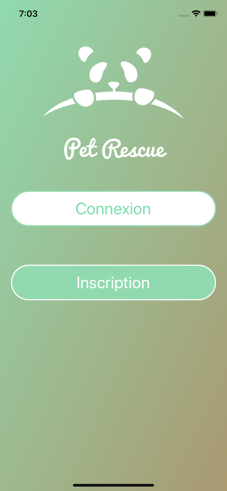
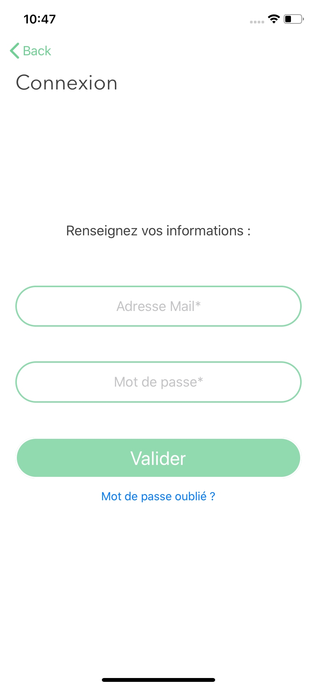
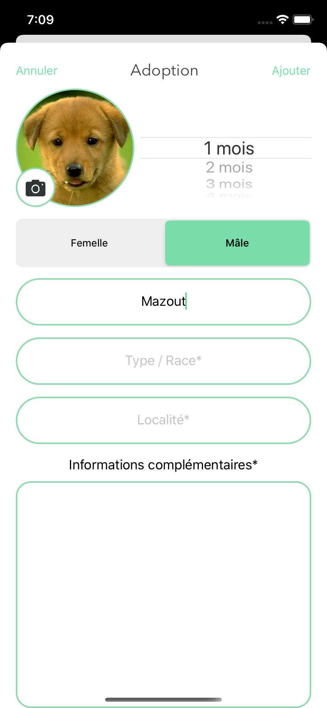
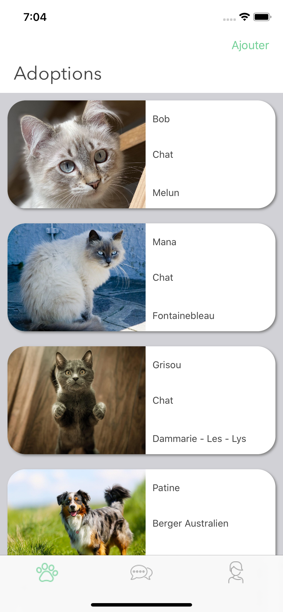
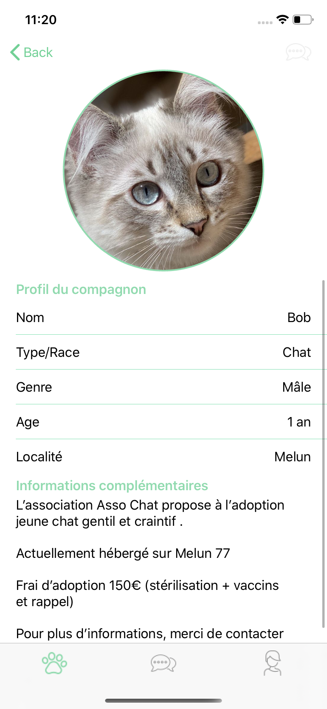
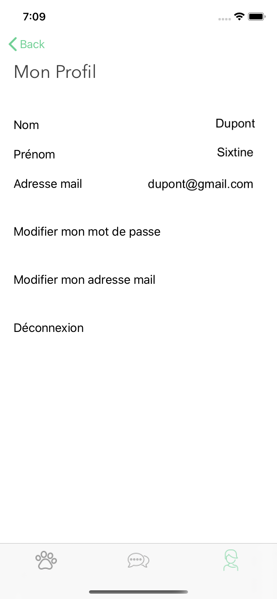
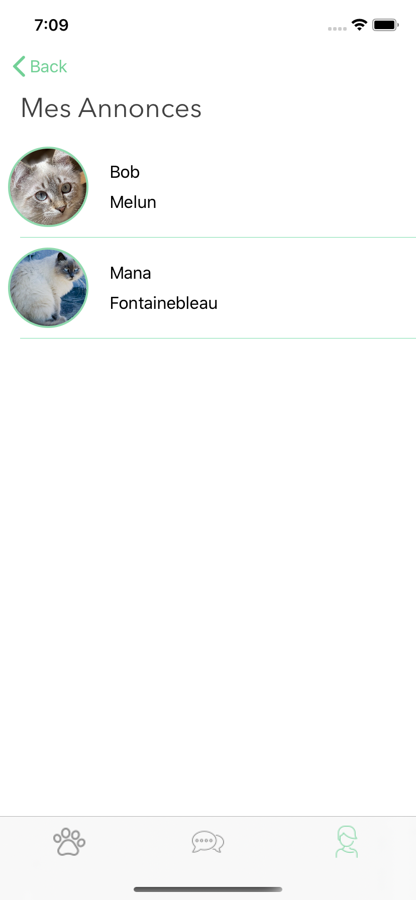
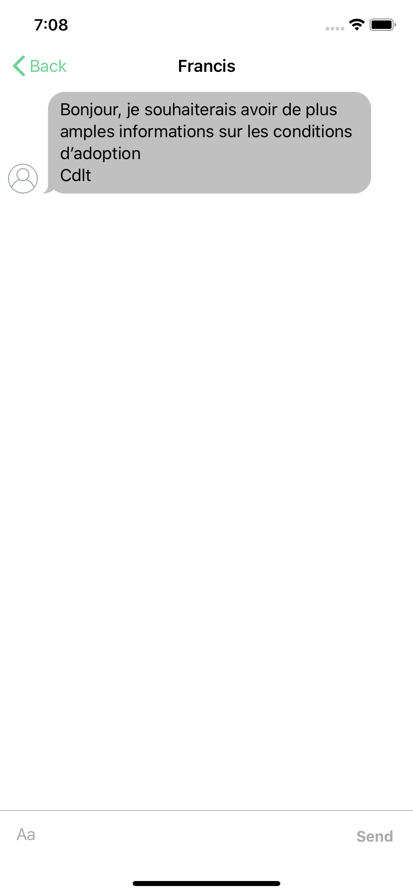

# Pet Rescue

## Tools
* Add libraries to Xcode project using **Cocoa Pods** :
  * __IQKeyboardManager__ prevent text fields from being hidden by the keyboard
  * __MessageKit__ make adding chat 💬 to a project easy

* Store datas in cloud with **Firebase** :
  * __Firebase Authentification__ for personalized authentication
  * __Cloud Firestore__ store users chat
  * __Realtime Database__ store users datas and ads datas
  * __Firebase Storage__ store pictures of animals from ads 
  
 ## What is Pet Rescue ?
The objective of the Pet Rescue application is to connect associations offering animals for adoption with individuals seeking to adopt.

## Sign up and authentification
Allow user to create an account or sign in with existing account. 
User can also request reset passaword.

.   .   

## Ads
User can create an ad which will be displayed in the main feed with all posted ads. 
Tap on ad allows user to see the details of it

.    .    

## Profil
User can access to his profil where he can change password, change email address and log out.
He can also access to his posted ads and delete those of his choice.

.   .

## Chat

.   .

 
